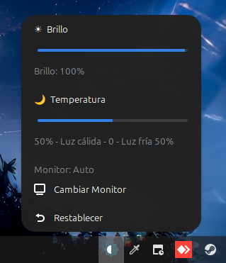

[English version](README.md)



# Brightness Control Applet para Cinnamon v1.2.0

Applet de control de brillo para monitores de escritorio en Cinnamon Desktop con control independiente.

## Características

### Funcionalidades Principales

- **Control independiente de brillo y temperatura** - Los cambios no afectan al otro control
- Control de brillo (0-100%) con validación de brillo mínimo
- Control de temperatura de color (cálida ↔ natural ↔ fría) mediante ajuste RGB

### Sistema de Control Dual

| Función     | ddcutil (Hardware) | xrandr (Software)  |
| ----------- | ------------------ | ------------------ |
| Brillo      | VCP 10 (0-100)     | `--brightness 0-1` |
| Temperatura | VCP 16/18/1A (RGB) | `--gamma r:g:b`    |

### Interfaz de Usuario

- **Iconos emoji** encima de cada slider
  - Brillo: ☀ (sol)
  - Temperatura: 🌙 (luna)
- Labels mostrando valores actuales
- **Soporte para múltiples monitores** con selector automático/manual
- **Botón de reset** para restaurar valores por defecto
- **Sección Acerca de** en configuración (versión, autor, enlace a GitHub)
- **Botón GitHub** para abrir la página del proyecto

### Configuración

- **Persistencia de configuración** entre sesiones
- Brillo mínimo configurable (0-50%)
- Modo de control configurable (hardware/software)
- Actualización en tiempo real opcional con debouncing de 150ms

### Rendimiento

- **Comandos optimizados** - brillo y gamma aplicados juntos en una sola llamada a xrandr
- Control multi-monitor con un solo comando

## Instalación

```bash
# Crear directorio del applet
mkdir -p ~/.local/share/cinnamon/applets/brightness-control@carlymx

# Copiar archivos
cp metadata.json applet.js settings-schema.json stylesheet.css ~/.local/share/cinnamon/applets/brightness-control@carlymx/

# Reiniciar Cinnamon
cinnamon --replace &
```

## Configuración

Click derecho en el applet → Configuración

### Ajustes

- **Brillo mínimo (%)**: Valor mínimo permitido del slider de brillo (0-50%)
- **Usar ddcutil**: Activar control de hardware (requiere ddcutil instalado)
- **Actualizar mientras deslizas**: Aplicar cambios en tiempo real con debouncing de 150ms
- **Acerca de**: Información de versión y autor
- **Abrir GitHub**: Botón para abrir la página del proyecto

### Selector de Monitor

Desde el menú del applet:

- **Monitor: Auto**: Ajusta todos los monitores conectados
- **Monitor específico**: Ajusta solo el monitor seleccionado
- **Botón "Cambiar Monitor"**: Cicla entre monitores disponibles

### Persistencia Automática

El applet guarda automáticamente:

- Último nivel de brillo configurado
- Última temperatura de color configurada
- Monitor seleccionado

Al reiniciar Cinnamon, estos valores se restauran automáticamente.

## Dependencias Opcionales

Para control de hardware con ddcutil:

```bash
sudo apt install ddcutil i2c-tools
sudo usermod -aG i2c $USER
```

### Códigos VCP de ddcutil

El applet usa estos códigos VCP para control de hardware:

| Código VCP | Función         | Rango                   |
| ---------- | --------------- | ----------------------- |
| 10         | Brillo          | 0-100                   |
| 14         | Preset de color | 0x05=6500K, 0x0b=User 1 |
| 16         | Ganancia Rojo   | 0-100                   |
| 18         | Ganancia Verde  | 0-100                   |
| 1A         | Ganancia Azul   | 0-100                   |

## Traducciones

El applet soporta múltiples idiomas mediante gettext. Los archivos de traducción están en el directorio `po/`.

### Archivos de Traducción

```
po/
├── brightness-control@carlymx.pot  # Plantilla (actualizar con: xgettext)
├── es.po                           # Traducciones al español
└── es/LC_MESSAGES/
    └── brightness-control@carlymx.mo  # Español compilado (instalar a locale)
```

### Instalar Traducciones

```bash
# Compilar .po a .mo
msgfmt -o po/es/LC_MESSAGES/brightness-control@carlymx.mo po/es.po
msgfmt -o po/en/LC_MESSAGES/brightness-control@carlymx.mo po/en.po

# Instalar a locale del sistema
mkdir -p ~/.local/share/locale/es/LC_MESSAGES
mkdir -p ~/.local/share/locale/en/LC_MESSAGES
cp po/es/LC_MESSAGES/brightness-control@carlymx.mo ~/.local/share/locale/es/LC_MESSAGES/
cp po/en/LC_MESSAGES/brightness-control@carlymx.mo ~/.local/share/locale/en/LC_MESSAGES/

# Reiniciar Cinnamon
cinnamon --replace &
```

### Actualizar Traducciones

Después de añadir nuevas strings traducibles en `applet.js`:

```bash
# Extraer strings a plantilla .pot
xgettext -o po/brightness-control@carlymx.pot \
  --language=JavaScript \
  --keyword=_ \
  brightness-control@carlymx/applet.js

# Fusionar con traducciones existentes (es.po)
msgmerge -U po/es.po po/brightness-control@carlymx.pot

# Fusionar con traducciones al inglés (en.po)
msgmerge -U po/en.po po/brightness-control@carlymx.pot
```

### Añadir Nuevo Idioma

1. Crear `po/<idioma>.po` desde la plantilla
2. Traducir todas las entradas `msgstr`
3. Compilar con: `msgfmt -o po/<idioma>/LC_MESSAGES/brightness-control@carlymx.mo po/<idioma>.po`
4. Instalar en: `~/.local/share/locale/<idioma>/LC_MESSAGES/`

## Restablecer Manualmente

```bash
# Software (GPU)
xrandr --output <monitor> --gamma 1:1:1
xrandr --output <monitor> --brightness 1.0

# Hardware (Monitor)
ddcutil setvcp 14 0x05    # Restablecer a 6500K
ddcutil setvcp 10 100     # Restablecer brillo a 100%
```

## Archivos

- `metadata.json` - Metadatos del applet
- `applet.js` - Implementación principal (~480 líneas)
- `settings-schema.json` - Esquema de configuración
- `stylesheet.css` - Estilos personalizados
- `AGENTS.md` - Guía de desarrollo

## Documentación

### [CHANGELOG.md](CHANGELOG.md) - Historial de Versiones

Historial completo de versiones con todos los cambios, correcciones de bugs y nuevas funcionalidades.

### [AGENTS.md](AGENTS.md) - Guía de Desarrollo

Guía completa para desarrolladores y agentes de IA:

- Comandos de build/instalación
- Convenciones de estilo de código
- Documentación de arquitectura
- Referencia de funciones clave
- Consejos de resolución de problemas

## Licencia

Ver archivo LICENSE para detalles.
